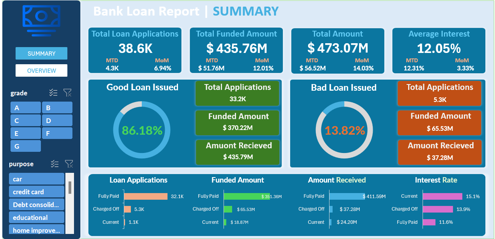
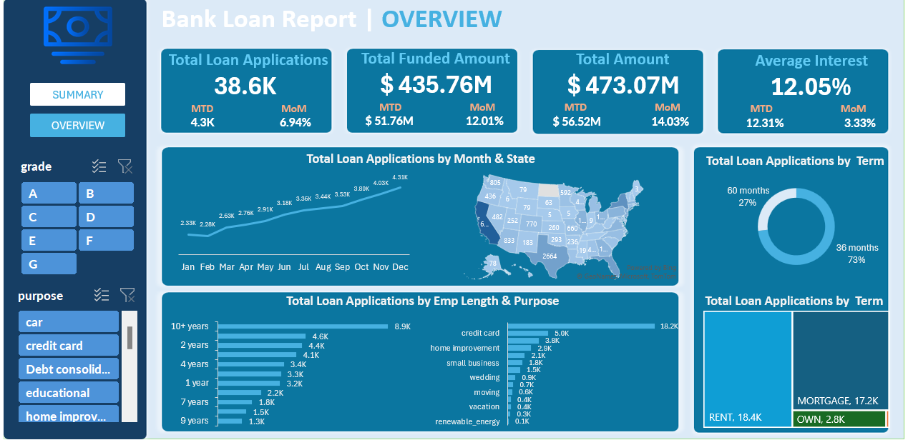

# Bank Loan Analysis Dashboard

This project involves a comprehensive **Bank Loan Analysis Dashboard** created using Excel. The dashboard provides insights into key loan performance metrics, helping stakeholders understand and evaluate the financial health of the lending portfolio.

## 📊 Project Overview

The dashboard is designed to address key performance indicators (KPIs) for analyzing loan applications, funded amounts, repayments, and more. It is segmented into two main views:

- **Summary Dashboard**: Highlights high-level KPIs and insights.
- **Overview Dashboard**: Delves deeper into trends and detailed metrics.

## 🚀 Features and KPIs

### Dashboard 1: Summary

The **Summary Dashboard** provides an overview of the following KPIs:

1. **Total Loan Applications**: Tracks the total number of applications received, along with Month-to-Date (MTD) and Month-over-Month (MoM) changes.
2. **Total Funded Amount**: Displays the total funds disbursed as loans, including MTD and MoM changes.
3. **Total Amount Received**: Shows repayments received from borrowers, with MTD and MoM variations.
4. **Average Interest Rate**: Calculates the average rate across all loans and its month-on-month trend.
5. **Average Debt-to-Income Ratio (DTI)**: Evaluates borrowers' financial health by analyzing the DTI.

---

### Dashboard 2: Overview

The **Overview Dashboard** provides deeper insights into trends and distributions, including:

- **Loan Applications by Month and State**: Displays regional trends in loan applications.
- **Loan Applications by Term**: Highlights the distribution of loans by duration (36 months vs. 60 months).
- **Loan Applications by Purpose**: Analyzes loan applications for various purposes (e.g., credit cards, home improvements).
- **Loan Applications by Employment Length**: Examines the distribution based on borrower employment duration.

## 🛠️ Tools and Techniques

- **Microsoft Excel**: Used to build interactive dashboards with pivot tables, slicers, and charts.

## 💡 Insights Gained

- Clear understanding of loan disbursement trends and repayment patterns.
- Identification of high-risk areas and optimal loan terms.
- Evaluation of borrower financial health through DTI analysis.

## 📩 Contact

- **Name**: Bahaa Medhat Wanas
- **Email**: [bahaawanas427@gmail.com](mailto:bahaawanas427@gmail.com)
- **LinkedIn**: [Bahaa Wanas](https://www.linkedin.com/in/bahaa-wanas-9797b923a/)
